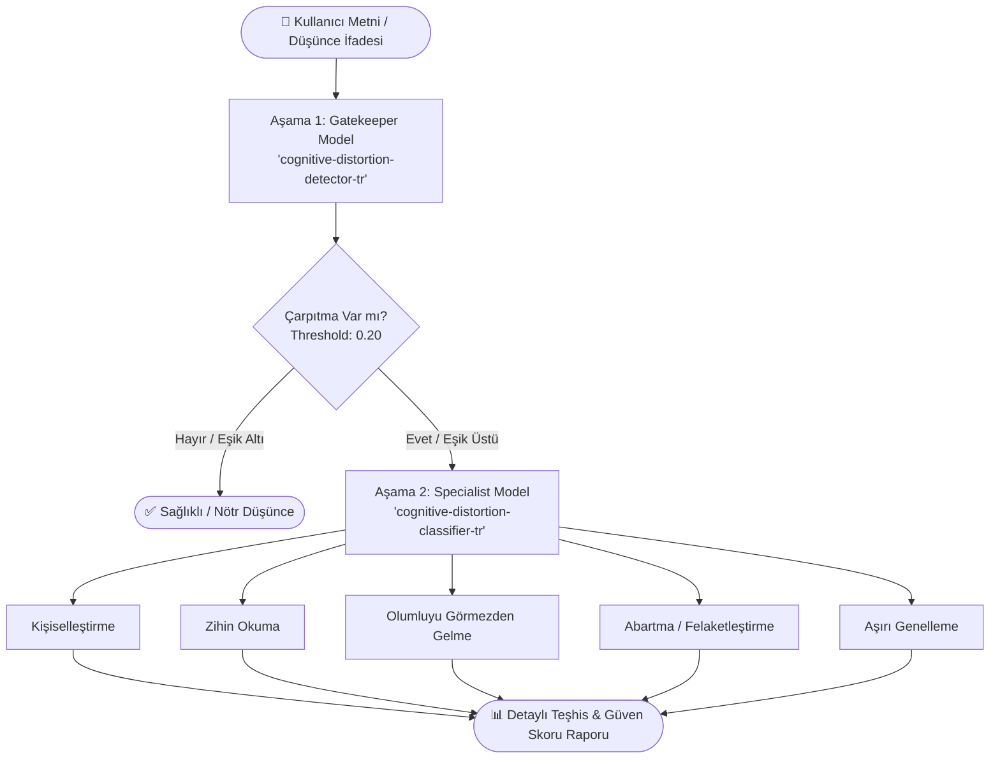

# 🧠 Türkçe Bilişsel Çarpıtma Tespit ve Sınıflandırma Sistemi
### (Turkish Cognitive Distortion Detector & Classifier)

[](https://www.python.org/)
[](https://pytorch.org/)
[](https://huggingface.co/mfurkanerkan15)
[](evaluation_results.md)
[](https://streamlit.io/)
[](LICENSE)

Bu proje, **Bilişsel Davranışçı Terapi (BDT / CBT)** ilkelerine dayalı olarak Türkçe metinlerdeki **bilişsel çarpıtmaları (otomatik olumsuz düşünce kalıplarını)** tespit etmek ve sınıflandırmak amacıyla geliştirilmiş **iki aşamalı hiyerarşik bir Doğal Dil İşleme (NLP)** sistemidir.

Proje, **BERTurk (`dbmdz/bert-base-turkish-cased`)** mimarisi üzerinde ince ayar (fine-tuning) yapılmış modellerle çalışır, **Focal Loss** optimizasyonu içerir ve kullanıcı dostu bir **Streamlit** arayüzü sunar.

---

## 🚀 Hugging Face Model Havuzu

Geliştirilen modeller doğrudan Hugging Face Hub üzerinde açık erişimli olarak yayınlanmıştır:

| Aşama | Model Adı & Hub Bağlantısı | Görev | Mimari |
| :--- | :--- | :--- | :--- |
| **Aşama 1 (Gatekeeper)** | [🤗 `mfurkanerkan15/cognitive-distortion-detector-tr`](https://huggingface.co/mfurkanerkan15/cognitive-distortion-detector-tr) | **İkili Sınıflandırma:** Metinde bilişsel çarpıtma **VAR** / **YOK** tespiti | BERTurk Binary Classification |
| **Aşama 2 (Specialist)** | [🤗 `mfurkanerkan15/cognitive-distortion-classifier-tr`](https://huggingface.co/mfurkanerkan15/cognitive-distortion-classifier-tr) | **Çok Sınıflı Teşhis:** 5 temel çarpıtma türünün sınıflandırılması | BERTurk Multi-class + Focal Loss |

---

## 🏗️ Sistem Mimarisi & Çalışma Mantığı

Doğrudan çok sınıflı sınıflandırma yerine **iki aşamalı hiyerarşik (Gatekeeper + Specialist)** yaklaşım benimsenmiştir:



1. **Aşama 1 (Filtre / Gatekeeper):** Cümlenin nötr/sağlıklı mı yoksa çarpıtma içerip içermediğini yüksek hassasiyetle (`threshold=0.20`) analiz eder.
2. **Aşama 2 (Uzman Teşhis / Specialist):** Çarpıtma tespit edilirse, metin ikinci modele yönlendirilerek spesifik çarpıtma kategorisi ve güven oranı belirlenir.

---

## 🧩 Hedeflenen Bilişsel Çarpıtma Kategorileri

| Kategori | Açıklama | Örnek İfade |
| :--- | :--- | :--- |
| **👤 Kişiselleştirme** | Doğrudan bağlantısı olmayan veya kontrol dışındaki olumsuz olaylardan kendini sorumlu tutma. | *"Toplantı kötü geçti, kesin benim yüzümden oldu."* |
| **🔮 Zihin Okuma** | Yeterli kanıt olmaksızın başkalarının kendisi hakkında olumsuz düşündüğünü varsayma. | *"Bana bakıp gülümsedi ama içinden benimle dalga geçtiğini biliyorum."* |
| **🙈 Olumluyu Görmezden Gelme** | Başarıları, övgüleri ve olumlu gelişmeleri şansa bağlayıp yok sayma. | *"Sınavdan 100 aldım ama sorular çok basitti, bir başarım yok."* |
| **💥 Abartma (Felaketleştirme)** | Küçük bir aksiliği veya hatayı telafisi imkansız bir felaket gibi algılama. | *"Bu sunumu yapamazsam tüm kariyerim tamamen bitecek."* |
| **🔁 Aşırı Genelleme** | Tek bir olumsuz deneyimden yola çıkarak genel ve mutlak kurallar çıkarma ("her zaman", "asla", "hiç kimse"). | *"İlk mülakattan elendim, ben asla hiçbir işte başarılı olamayacağım."* |

---

## 📊 Deneysel Değerlendirme & Başarım Sonuçları

Modellerin performansı, bağımsız test kümeleri üzerinde **`evaluate.py`** betiği aracılığıyla somut metriklerle değerlendirilmiştir.

### 1. Aşama 1: Gatekeeper (VAR / YOK İkili Sınıflandırma)
*Toplam Test Örneği: 448 (Dengeli: 224 Sağlıklı / 224 Çarpıtma)*

| Sınıf / Durum | Precision (%) | Recall (%) | F1-Score (%) | Destek (N) |
| :--- | :---: | :---: | :---: | :---: |
| **YOK (Sağlıklı / Nötr)** | %95.69 | **%99.11** | **%97.37** | 224 |
| **VAR (Bilişsel Çarpıtma)** | **%99.07** | %95.54 | %97.27 | 224 |
| **Macro Ortalama** | **%97.38** | **%97.32** | **%97.32** | 448 |
| **Genel Doğruluk (Accuracy)** | \- | \- | **%97.32** | 448 |

> **Analiz:** Sağlıklı düşünceleri yanlış yere çarpıtma olarak etiketlememe oranı (YOK Recall: %99.11) son derece yüksektir. 224 sağlıklı test cümlesinden yalnızca 2 tanesi yanlış sınıflandırılmıştır.

---

### 2. Aşama 2: Specialist (5 Sınıflı Uzman Teşhis)
*Toplam Test Örneği: 706*

| Sınıf / Kategori | Precision (%) | Recall (%) | F1-Score (%) | Destek (N) |
| :--- | :---: | :---: | :---: | :---: |
| **👤 Kişiselleştirme** | %97.08 | %95.00 | %96.03 | 140 |
| **🔮 Zihin Okuma** | **%100.00** | %97.86 | **%98.92** | 140 |
| **🙈 Olumluyu Görmezden Gelme** | %94.33 | %98.52 | %96.38 | 135 |
| **💥 Abartma (Felaketleştirme)** | %96.60 | **%99.30** | %97.93 | 143 |
| **🔁 Aşırı Genelleme** | %96.53 | %93.92 | %95.21 | 148 |
| **Macro Ortalama** | **%96.91** | **%96.92** | **%96.89** | 706 |
| **Genel Doğruluk (Accuracy)** | \- | \- | **%96.88** | 706 |

> **Analiz:** 5 sınıf arasında homojen bir öğrenme sağlanmıştır. Özellikle *Zihin Okuma* (%100 Precision) ve *Abartma* (%99.30 Recall) sınıflarında ayırt edicilik üst düzeydedir.

---

### 3. Uçtan Uca (End-to-End) Hiyerarşik Pipeline Performansı
*Gatekeeper Filtresi (Threshold: 0.20) + Specialist Model Tümleşik Testi (930 Örnek)*

| Sınıf / Kategori | Precision (%) | Recall (%) | F1-Score (%) | Destek (N) |
| :--- | :---: | :---: | :---: | :---: |
| **Sağlıklı / Yok** | %90.61 | %99.11 | %94.67 | 224 |
| **Kişiselleştirme** | %96.97 | %91.43 | %94.12 | 140 |
| **Zihin Okuma** | %100.00 | %97.14 | %98.55 | 140 |
| **Olumluyu Görmezden Gelme** | %94.81 | %94.81 | %94.81 | 135 |
| **Abartma** | %96.58 | %98.60 | %97.58 | 143 |
| **Aşırı Genelleme** | %95.59 | %87.84 | %91.55 | 148 |
| **Pipeline Macro Ortalama** | **%95.76** | **%94.82** | **%95.21** | 930 |
| **Pipeline Genel Doğruluk** | \- | \- | **%95.16** | 930 |

---

### 🧪 Model Sağlamlığı & Sınır Testleri (Stress / OOD Testing)

Modelin ezber yapmadığını (lexical shortcut) ve bağlamsal anlamsal kavrayışa sahip olduğunu doğrulamak için özel sınır testleri uygulanmıştır:

1. **Doğal Yas / Hüzün Ayrımı (Duygu Analizi Tuzağı):**
   - *Girdi:* `"Bugün dedemi kaybettim, içim çok acıyor ve çok ağladım."*
   - *Sonuç:* `✅ Sağlıklı / Rasyonel` (Yoğun negatif duygular içermesine rağmen bilişsel çarpıtma olarak etiketlenmemiştir).
2. **Kural Cümlelerinde Mutlak İfadeler:**
   - *Girdi:* `"Trafikte asla emniyet kemerimi takmadan yola çıkmam."*
   - *Sonuç:* `✅ Sağlıklı / Rasyonel` (*"Asla"* kelimesine rağmen aşırı genelleme hatasına düşülmemiştir).
3. **Başarıyı Küçümseme Nüansı:**
   - *Girdi:* `"Projeyi birinci bitirdik ama rakipler çok yetersizdi, bizimle alakası yok."*
   - *Sonuç:* `🚨 Olumluyu Görmezden Gelme` (%98+ güven).

---

## 📁 Veri Seti Mimarisi & Metodolojisi

Veri seti, bilişsel davranışçı terapi (BDT) literatüründeki temel düşünce kalıpları referans alınarak Türkçe doğal dil işleme görevine uygun biçimde yapılandırılmıştır.

```plaintext
┌────────────────────────────────────────────────────────┐
│               VERİ SETİ MİMARİSİ                       │
├──────────────────────────┬─────────────────────────────┤
│ Aşama 1 Veri Seti        │ ~2.240 Örnek (Dengeli)      │
│ (VAR / YOK Filtresi)     │  ├─ 1.120 Sağlıklı / Nötr   │
│                          │  └─ 1.120 Bilişsel Çarpıtma │
├──────────────────────────┼─────────────────────────────┤
│ Aşama 2 Veri Seti        │ ~4.700 Örnek (5 Kategori)   │
│ (Uzman Teşhis)           │  ├─ Kişiselleştirme         │
│                          │  ├─ Zihin Okuma             │
│                          │  ├─ Olumluyu Görmezden Gelme│
│                          │  ├─ Abartma                 │
│                          │  └─ Aşırı Genelleme         │
└──────────────────────────┴─────────────────────────────┘
```

### 🔬 Veri Derleme, Sentetik Veri Artırma & Etiketleme Kalite Güvencesi
- **Özgün Klinik & Günlük Yaşam Kalıpları:** Psikoeğitim kaynaklarından, BDT terapi vaka örneklerinden ve günlük konuşma dilinden titizlikle derlenmiştir.
- **Kontrollü Sentetik Veri Artırma (LLM-Assisted Augmentation):** Nadir rastlanan düşünce kalıplarını desteklemek, sınıf dengesini korumak ve anlamsal varyasyonu (farklı ifade biçimleri, duygu tonları) artırmak amacıyla büyük dil modellerinden kontrollü olarak faydalanılmıştır.
- **Etiketleme Doğrulaması & Cohen's Kappa ($\kappa$) Uyum Güvenilirliği:**
  - Üretilen sentetik ve derlenen verilerin bilişsel çarpıtma kategorileri bağımsız etiketleyiciler / hakemler tarafından çapraz doğrulamaya tabi tutulmuştur.
  - Değerlendiriciler arası tutarlılık ve güvenilirlik **Cohen's Kappa ($\kappa$)** katsayısı ile ölçülmüş; yüksek uzlaşma (substantial / almost perfect agreement) sağlanan, anlamsal belirsizlik taşımayan net örnekler nihai eğitim ve test kümelerine dahil edilmiştir.
- **Tabakalı Veri Bölümleme (Stratified Split):** Sınıf oranları korunarak Aşama 1 için %80 Eğitim / %20 Test; Aşama 2 için %85 Eğitim / %15 Test ayrımı uygulanmıştır.

---

## 💡 Metodolojik Sınırlar & Dürüst Değerlendirme (Limitations)

- **Tek Etiketli (Single-Label) Yaklaşım:** Gerçek hayatta insan düşünceleri aynı anda birden fazla bilişsel çarpıtma barındırabilir (*Örn: Hem Zihin Okuma hem Aşırı Genelleme*). Mevcut sistem en baskın çarpıtmayı tespit etmeye odaklanmıştır; gelecekte *Multi-Label Classification* mimarisine genişletilebilir.
- **Öznellik Payı:** Psikolojik etiketleme doğası gereği özneldir. Test setinde elde edilen %95+ F1 başarısı in-distribution ve kontrollü sınır testlerinde doğrulanmış olup, gerçek dünya kullanımında bağlam ve klinik uzman görüşü esastır.

---

## 💻 Kurulum & Çalıştırma

### 1. Depoyu Klonlayın
```bash
git clone https://github.com/mfurkanerkan15/Cognitive-distortion-detection-system.git
cd Cognitive-distortion-detection-system
```

### 2. Sanal Ortam Oluşturun ve Aktif Edin
```powershell
# Windows
python -m venv .venv
.\.venv\Scripts\Activate.ps1

# Linux / MacOS
python3 -m venv .venv
source .venv/bin/activate
```

### 3. Bağımlılıkları Yükleyin
```bash
pip install -r requirements.txt
```

*(GPU desteği ile kurulum için)*:
```bash
pip install torch torchvision torchaudio --index-url https://download.pytorch.org/whl/cu121
pip install -r requirements.txt
```

### 4. Web Arayüzünü Başlatın
```bash
streamlit run app.py
```

### 5. Değerlendirme Metriklerini Yeniden Üretin (Reproducibility)
```bash
# Tüm metrikleri hesaplar ve evaluation_results.md dosyasını üretir:
python evaluate.py

# Karışıklık matrisi grafiklerini PNG olarak kaydetmek için:
python evaluate.py --save_plots
```

---

## 📁 Proje Dosya Yapısı

```plaintext
cognitive-distortion-detector/
├── app.py                   # Streamlit web uygulaması ve çıkarım (inference) pipeline'ı
├── evaluate.py              # Kapsamlı model değerlendirme ve metrik üretim betiği
├── train_model1.py          # Aşama 1 Gatekeeper modeli eğitim betiği
├── train_model2.py          # Aşama 2 Specialist modeli eğitim ve değerlendirme betiği
├── train_model2_focal.py    # Dengesiz veri setleri için Focal Loss destekli Aşama 2 eğitimi
├── label_map.json           # Sınıf etiketleri haritası (ID <-> Label)
├── evaluation_results.md    # Otomatik üretilen detaylı değerlendirme raporu
├── evaluation_results.json  # Sayısal değerlendirme çıktısı
├── requirements.txt         # Gerekli Python kütüphaneleri
├── LICENSE                  # MIT Lisans dosyası
└── README.md                # Proje dokümantasyonu
```

---

## 🔬 Model Eğitimi & İleri Teknikler

- **Önceden Eğitilmiş Temel Model:** `dbmdz/bert-base-turkish-cased`
- **Optimizasyon:** AdamW optimizasyon algoritması, linear warmup ile öğrenme oranı planlaması.
- **Focal Loss Entegrasyonu (`train_model2_focal.py`):** Zor ve sınırda kalan örnekleri daha iyi öğrenebilmek amacıyla özelleştirilmiş `FocalLossTrainer` ($\gamma = 2.0$).
- **Değerlendirme Metrikleri:** Accuracy, Macro/Weighted Precision, Recall, F1-Score ve Confusion Matrix.

---

## ⚠️ Yasal ve Etik Bildirim (Disclaimer)

> [!NOTE]
> Bu proje, **akademik araştırma ve Doğal Dil İşleme (NLP) teknolojilerinin psikolojik metin analizindeki uygulanabilirliğini göstermek amacıyla deneysel olarak geliştirilmiştir.**
> 
> Sistem tarafından üretilen sonuçlar **tıbbi bir teşhis, klinik değerlendirme veya profesyonel psikoterapi yerine geçmez.** Ruh sağlığı konularında lütfen uzman bir psikiyatrist veya klinik psikoloğa danışınız.

---

## 👨‍💻 Geliştirici & İletişim

**M. Furkan Erkan**

- **Hugging Face:** [@mfurkanerkan15](https://huggingface.co/mfurkanerkan15)
- **GitHub:** [@mfurkanerkan15](https://github.com/mfurkanerkan15)

Proje ile ilgili geri bildirim, katkı veya sorularınız için issue açabilir veya Hugging Face üzerinden iletişime geçebilirsiniz.
